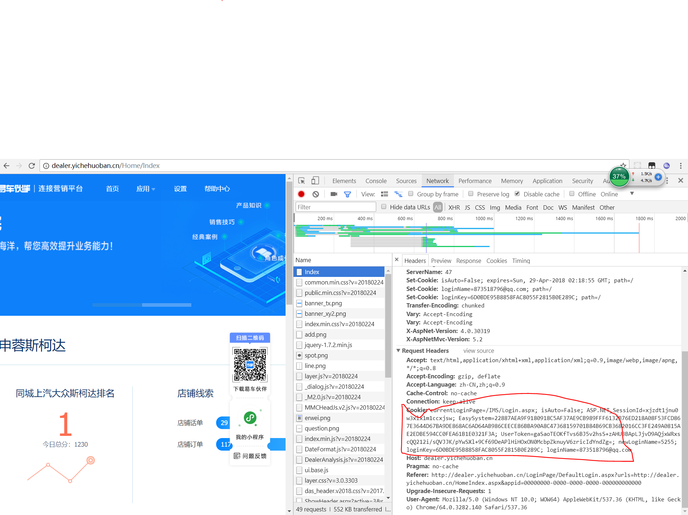
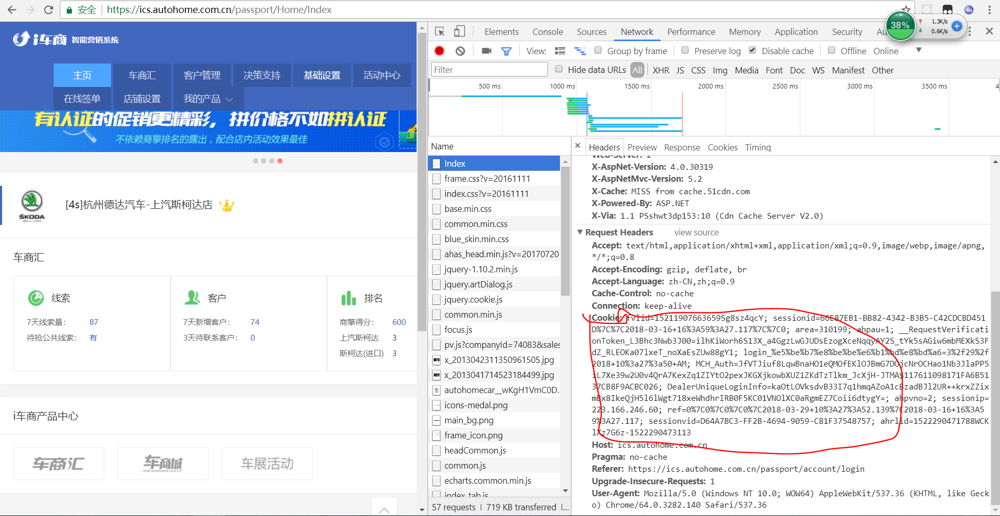
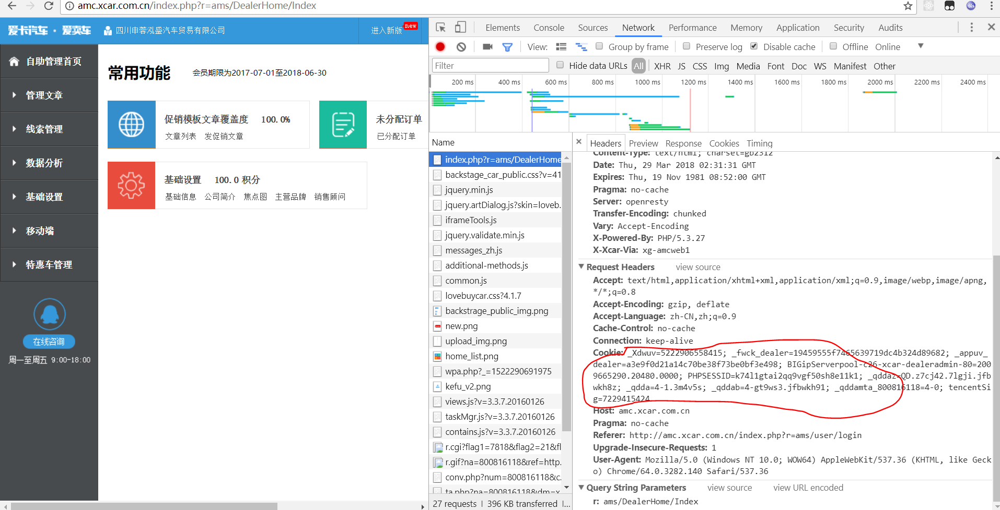

## 环境python 3.5
## 系统win7
### 依赖

```sh
pip install -r requments.txt
```


## 配置 在setting.py文件中
```
# FTP
HOST = ''
USERNAME = ''
PASSWD = ''


# 通知回调
CALLBACK_URL = ""

# 通知邮邮箱
E_MAIL = [
    'chenli90s@qq.com'
]
```

## 易车



cookie路径为`http://dealer.yichehuoban.cn/Home/Index`

```
python spider.py --yiche "这里放上cook"
```

## 汽车之家



cookie路径为`https://ics.autohome.com.cn/passport/Home/Index`

运行脚本的ip必须与取得cookie的ip一致！

```
python spider.py --carhome "这里放上cook"
```

## 爱卡




cookie路径为`http://amc.xcar.com.cn/index.php?r=ams/DealerHome/Index`
```
python spider.py --icar "这里放上cook"
```


